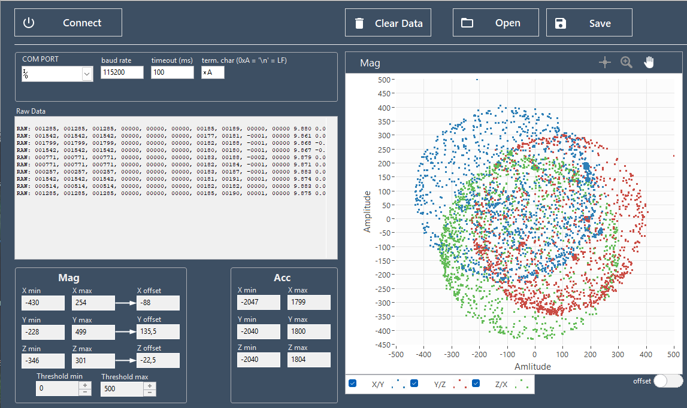
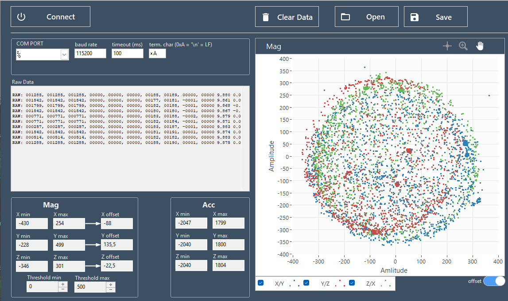

# eCompassCalibration

Baudrate:    115200

Datenformat:

sprintf((char*) data,

"RAW: %06d, %06d, %06d, %05d, %05d, %05d, %05d, %05d, %05d, %05d, %.03f, %.03f, %.03f\n\r",

acc.x, acc.y, acc.z, gyr.x, gyr.y,gyr.z, mag.x, mag.y, mag.z, temp, acc.x, acc.y, acc.z);

# LabView Software

