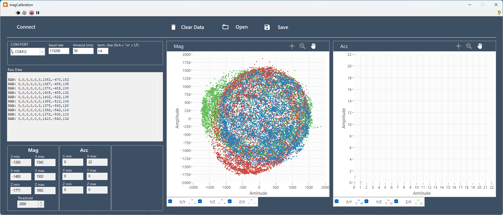

# eCompassCalibration

Baudrate:    115200

Datenformat:  sprintf((char*)data, "RAW: %d,%d,%d,%d,%d,%d,%d,%d,%d\n\r", acc.x, acc.y, acc.z, gyr.x, gyr.y,gyr.z, mag.x, mag.y, mag.z);

# LabView Software

